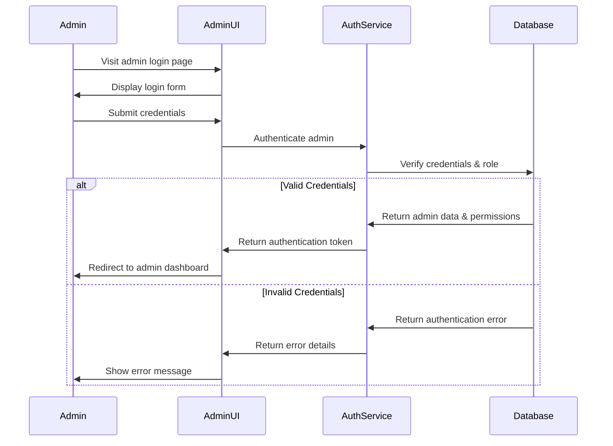
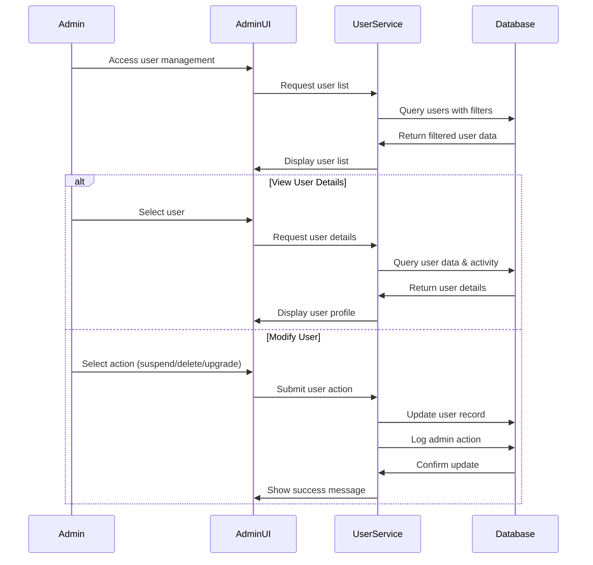

# Design Document: Admin Dashboard

## Overview

This design document outlines the implementation approach for the Spendify Admin Dashboard. The dashboard will provide administrators with comprehensive tools to manage users, view analytics, track revenue, monitor document processing, handle support queries, manage AI feedback, configure application settings, and maintain security. The design focuses on creating a clean, responsive, and modern interface that follows best practices for admin dashboards.

## Architecture

The Admin Dashboard will be integrated into the existing Spendify React application with the following architectural components:

1. **Frontend Components**:
   - Dashboard layout with sidebar navigation
   - Data visualization components for analytics and reporting
   - CRUD interfaces for user and system management
   - Filtering and search components for data exploration
   - Role-based access control UI

2. **Backend Services**:
   - Admin authentication and authorization service
   - Data aggregation services for analytics
   - User management services
   - Document processing monitoring services
   - Support ticket management services
   - Configuration and settings management services

3. **Database Extensions**:
   - Admin users and roles tables
   - Audit logs table
   - Support tickets table
   - System configuration table
   - AI feedback and training data tables

## Components and Interfaces

### Dashboard Layout

The admin dashboard will use a responsive layout with a persistent sidebar navigation and a main content area. The layout will support both light and dark modes for optimal viewing in different environments.

```tsx
// Main dashboard layout
const AdminDashboardLayout = ({ children }: { children: React.ReactNode }) => {
  return (
    <div className="admin-dashboard-layout">
      <AdminSidebar />
      <main className="admin-content">
        <AdminHeader />
        <div className="admin-content-container">
          {children}
        </div>
      </main>
    </div>
  );
};
```

### User Management Components

1. **User List Component**
   ```tsx
   // User list with filtering and actions
   const UserManagementList = () => {
     const [filter, setFilter] = useState('all');
     const { users, isLoading } = useUsers(filter);
     
     return (
       <div className="user-management">
         <UserFilterControls value={filter} onChange={setFilter} />
         {isLoading ? (
           <LoadingSpinner />
         ) : (
           <UserTable 
             users={users} 
             onViewDetails={handleViewDetails}
             onSuspend={handleSuspend}
             onDelete={handleDelete}
             onUpgrade={handleUpgrade}
           />
         )}
       </div>
     );
   };
   ```

2. **User Detail Component**
   ```tsx
   // User details with activity log
   const UserDetailView = ({ userId }: { userId: string }) => {
     const { user, isLoading } = useUserDetails(userId);
     const { activityLogs } = useUserActivityLogs(userId);
     
     return (
       <div className="user-detail-view">
         {isLoading ? (
           <LoadingSpinner />
         ) : (
           <>
             <UserProfileCard user={user} />
             <UserActionPanel userId={userId} />
             <ActivityLogTimeline logs={activityLogs} />
           </>
         )}
       </div>
     );
   };
   ```

### Analytics & Insights Components

1. **Dashboard Overview Component**
   ```tsx
   // Main analytics dashboard
   const AnalyticsDashboard = () => {
     const { metrics } = useAnalyticsMetrics();
     
     return (
       <div className="analytics-dashboard">
         <MetricCardsRow metrics={metrics} />
         <div className="charts-grid">
           <UserGrowthChart />
           <RetentionChart />
           <DocumentUploadsChart />
           <RevenueByPlanChart />
         </div>
         <ConversionFunnelVisualization />
       </div>
     );
   };
   ```

2. **Detailed Metrics Component**
   ```tsx
   // Detailed metrics with filtering
   const DetailedMetricsView = () => {
     const [timeRange, setTimeRange] = useState('month');
     const { metrics } = useDetailedMetrics(timeRange);
     
     return (
       <div className="detailed-metrics">
         <TimeRangeSelector value={timeRange} onChange={setTimeRange} />
         <MetricsTable data={metrics} />
         <ExportButton onExport={handleExportMetrics} />
       </div>
     );
   };
   ```

### Revenue & Billing Components

1. **Revenue Dashboard Component**
   ```tsx
   // Revenue tracking dashboard
   const RevenueDashboard = () => {
     const [filters, setFilters] = useState({
       planType: 'all',
       timeRange: 'month'
     });
     const { revenueData } = useRevenueData(filters);
     
     return (
       <div className="revenue-dashboard">
         <RevenueFilterControls 
           filters={filters} 
           onChange={setFilters} 
         />
         <RevenueMetricsCards data={revenueData.summary} />
         <RevenueChart data={revenueData.timeline} />
         <RevenueByPlanBreakdown data={revenueData.byPlan} />
         <ExportCSVButton onExport={handleExportRevenue} />
       </div>
     );
   };
   ```

2. **AppSumo Redemptions Component**
   ```tsx
   // AppSumo code redemption tracking
   const AppSumoRedemptionsView = () => {
     const { redemptions, isLoading } = useAppSumoRedemptions();
     
     return (
       <div className="appsumo-redemptions">
         <RedemptionsSummaryCards data={redemptions.summary} />
         <RedemptionsTable 
           data={redemptions.list} 
           isLoading={isLoading} 
         />
       </div>
     );
   };
   ```

### Document Processing Components

1. **Processing Queue Component**
   ```tsx
   // Document processing queue
   const DocumentProcessingQueue = () => {
     const [filter, setFilter] = useState('all');
     const { documents, isLoading } = useDocumentQueue(filter);
     
     return (
       <div className="document-queue">
         <StatusFilterTabs value={filter} onChange={setFilter} />
         <AIModelVersionBadge />
         <DocumentQueueTable 
           documents={documents} 
           isLoading={isLoading}
           onReprocess={handleReprocess}
           onManualTag={handleManualTag}
         />
       </div>
     );
   };
   ```

2. **Document Detail Component**
   ```tsx
   // Document processing detail view
   const DocumentDetailView = ({ documentId }: { documentId: string }) => {
     const { document, metadata, isLoading } = useDocumentDetails(documentId);
     
     return (
       <div className="document-detail">
         {isLoading ? (
           <LoadingSpinner />
         ) : (
           <>
             <DocumentMetadataCard metadata={metadata} />
             <DocumentPreview document={document} />
             <ProcessingHistoryTimeline document={document} />
             <DocumentActionPanel documentId={documentId} />
           </>
         )}
       </div>
     );
   };
   ```

### Support & User Queries Components

1. **Support Tickets Component**
   ```tsx
   // Support tickets management
   const SupportTicketsView = () => {
     const [filter, setFilter] = useState('open');
     const [search, setSearch] = useState('');
     const { tickets, isLoading } = useSupportTickets(filter, search);
     
     return (
       <div className="support-tickets">
         <TicketFilterControls 
           filter={filter} 
           onFilterChange={setFilter} 
         />
         <SearchBar value={search} onChange={setSearch} />
         <TicketsTable 
           tickets={tickets} 
           isLoading={isLoading}
           onAssign={handleAssignTicket}
           onStatusChange={handleStatusChange}
           onExportLogs={handleExportLogs}
         />
       </div>
     );
   };
   ```

2. **Ticket Detail Component**
   ```tsx
   // Support ticket detail view
   const TicketDetailView = ({ ticketId }: { ticketId: string }) => {
     const { ticket, messages, isLoading } = useTicketDetails(ticketId);
     
     return (
       <div className="ticket-detail">
         {isLoading ? (
           <LoadingSpinner />
         ) : (
           <>
             <TicketHeader ticket={ticket} />
             <MessageThread messages={messages} />
             <TicketResponseForm ticketId={ticketId} />
             <TicketActionPanel ticketId={ticketId} />
           </>
         )}
       </div>
     );
   };
   ```

### AI Feedback Loop Components

1. **AI Feedback Dashboard Component**
   ```tsx
   // AI feedback management
   const AIFeedbackDashboard = () => {
     const { feedback, metrics, isLoading } = useAIFeedback();
     
     return (
       <div className="ai-feedback-dashboard">
         <AIPerformanceMetricsCards metrics={metrics} />
         <AIAccuracyChart data={metrics.accuracyTrend} />
         <FeedbackCategoriesBreakdown data={feedback.categories} />
         <MisclassificationsTable 
           data={feedback.misclassifications} 
           onReview={handleReviewMisclassification}
           onSubmitForTraining={handleSubmitForTraining}
         />
       </div>
     );
   };
   ```

2. **AI Model Management Component**
   ```tsx
   // AI model version management
   const AIModelManagement = () => {
     const { models, currentModel, isLoading } = useAIModels();
     
     return (
       <div className="ai-model-management">
         <CurrentModelCard model={currentModel} />
         <ModelVersionHistory models={models} />
         <ModelPerformanceComparison models={models} />
         <TrainingDatasetManagement />
       </div>
     );
   };
   ```

### Admin Settings Components

1. **Feature Flags Component**
   ```tsx
   // Feature flags management
   const FeatureFlagsManagement = () => {
     const { features, isLoading, updateFeature } = useFeatureFlags();
     
     return (
       <div className="feature-flags">
         <FeatureFlagsTable 
           features={features} 
           isLoading={isLoading}
           onToggleFeature={updateFeature}
         />
         <AddFeatureFlagForm onAdd={handleAddFeature} />
       </div>
     );
   };
   ```

2. **App Configuration Component**
   ```tsx
   // Application configuration
   const AppConfigurationView = () => {
     const { config, isLoading, updateConfig } = useAppConfiguration();
     
     return (
       <div className="app-configuration">
         <ConfigurationForm 
           config={config} 
           isLoading={isLoading}
           onSave={updateConfig}
         />
         <AnnouncementBannerEditor />
         <SystemLimitsConfiguration />
       </div>
     );
   };
   ```

### Security & Logs Components

1. **Admin Users Management Component**
   ```tsx
   // Admin users and roles management
   const AdminUsersManagement = () => {
     const { admins, roles, isLoading } = useAdminUsers();
     
     return (
       <div className="admin-users-management">
         <AdminRolesTable roles={roles} />
         <AdminUsersTable 
           admins={admins} 
           roles={roles}
           isLoading={isLoading}
           onAddAdmin={handleAddAdmin}
           onEditRole={handleEditRole}
           onRemoveAdmin={handleRemoveAdmin}
         />
       </div>
     );
   };
   ```

2. **Audit Logs Component**
   ```tsx
   // Audit logs viewer
   const AuditLogsView = () => {
     const [filters, setFilters] = useState({
       action: 'all',
       admin: 'all',
       dateRange: { start: null, end: null }
     });
     const { logs, isLoading } = useAuditLogs(filters);
     
     return (
       <div className="audit-logs">
         <LogFilterControls 
           filters={filters} 
           onFilterChange={setFilters} 
         />
         <AuditLogsTable logs={logs} isLoading={isLoading} />
         <ExportLogsButton onExport={handleExportLogs} />
       </div>
     );
   };
   ```

## Data Flow Diagrams

### Admin Authentication Flow



### User Management Flow



## Data Models

### Admin User Model

```typescript
interface AdminUser {
  id: string;
  email: string;
  full_name: string;
  role: 'viewer' | 'moderator' | 'admin' | 'super_admin';
  permissions: string[];
  created_at: Date;
  last_login_at: Date;
  created_by?: string; // ID of admin who created this admin
  is_active: boolean;
}
```

### Audit Log Model

```typescript
interface AuditLog {
  id: string;
  admin_id: string;
  action: string;
  entity_type: 'user' | 'document' | 'ticket' | 'setting' | 'admin' | 'feature';
  entity_id: string;
  details: Record<string, any>;
  ip_address: string;
  user_agent: string;
  created_at: Date;
}
```

### Support Ticket Model

```typescript
interface SupportTicket {
  id: string;
  user_id: string;
  subject: string;
  status: 'open' | 'in_progress' | 'resolved' | 'flagged';
  priority: 'low' | 'medium' | 'high' | 'urgent';
  assigned_to?: string; // Admin ID
  created_at: Date;
  updated_at: Date;
  resolved_at?: Date;
  source: 'email' | 'chat' | 'in_app';
}

interface TicketMessage {
  id: string;
  ticket_id: string;
  sender_type: 'user' | 'admin' | 'system';
  sender_id: string;
  content: string;
  attachments?: string[];
  created_at: Date;
}
```

### Feature Flag Model

```typescript
interface FeatureFlag {
  id: string;
  name: string;
  description: string;
  enabled: boolean;
  user_percentage?: number; // For gradual rollout
  allowed_plans?: string[]; // Plans that have access
  created_at: Date;
  updated_at: Date;
  created_by: string; // Admin ID
  last_updated_by: string; // Admin ID
}
```

### AI Feedback Model

```typescript
interface AIFeedback {
  id: string;
  user_id: string;
  model_version: string;
  input_data: Record<string, any>;
  expected_output?: Record<string, any>;
  actual_output: Record<string, any>;
  feedback_type: 'incorrect' | 'helpful' | 'not_helpful' | 'other';
  user_comment?: string;
  created_at: Date;
  reviewed: boolean;
  reviewed_by?: string; // Admin ID
  reviewed_at?: Date;
  added_to_training: boolean;
}
```

## Error Handling

1. **Authentication Errors**
   - Invalid admin credentials
   - Insufficient permissions for action
   - Session timeout

2. **Data Access Errors**
   - Database connection issues
   - Query timeout or failure
   - Missing or corrupt data

3. **Action Execution Errors**
   - User modification failures
   - Configuration update errors
   - Export generation failures

4. **Error Display Strategy**
   - Toast notifications for non-critical errors
   - Modal dialogs for critical errors requiring attention
   - Inline error messages for form validation issues
   - Error logging to audit system for all admin-facing errors

## Testing Strategy

1. **Unit Tests**
   - Test individual admin components in isolation
   - Test data transformation and formatting functions
   - Test permission checking logic

2. **Integration Tests**
   - Test admin authentication flow
   - Test user management operations
   - Test configuration changes and their effects

3. **E2E Tests**
   - Test complete admin workflows
   - Test role-based access controls
   - Test critical administrative functions

4. **Security Tests**
   - Test permission boundaries between admin roles
   - Test audit logging functionality
   - Test against common security vulnerabilities

5. **Performance Tests**
   - Test dashboard loading with large datasets
   - Test export functionality with large data volumes
   - Test filtering and search performance