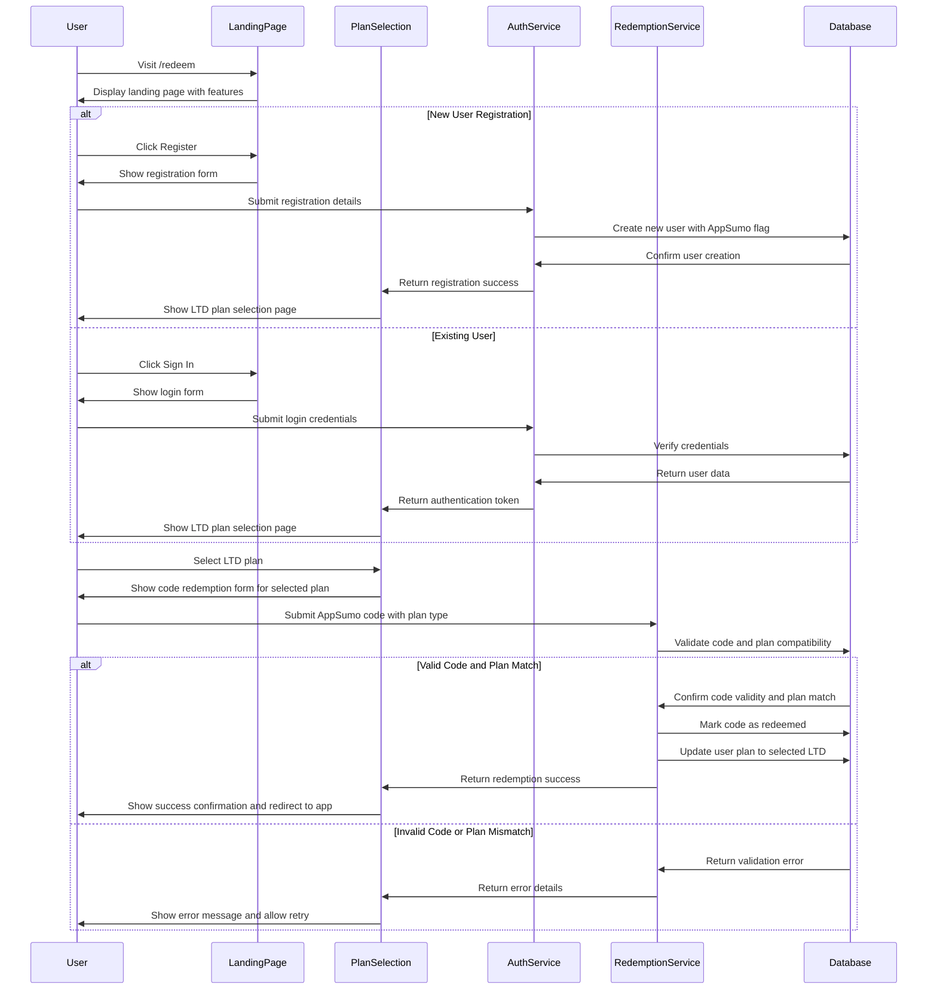

# Design Document: AppSumo LTD Landing Page

## Overview

This design document outlines the implementation approach for the AppSumo Lifetime Deal (LTD) landing page and redemption system. The feature will provide a dedicated landing page at `/redeem` that showcases SpendlyAI's features through interactive visualizations, communicates LTD benefits, and enables users to register and redeem their AppSumo codes to access their purchased plans.

## Architecture

The AppSumo LTD landing page will be integrated into the existing SpendlyAI React application with the following architectural components:

1. **Frontend Components**:
   - Landing page with feature showcases and interactive visualizations
   - Registration form for new AppSumo users
   - Code redemption interface
   - Authentication integration with existing system

2. **Backend Services**:
   - AppSumo code validation and redemption service
   - User registration with AppSumo-specific attributes
   - Plan activation based on code redemption

3. **Database Extensions**:
   - AppSumo codes table
   - User plan type extensions for LTD plans
   - Redemption tracking and analytics

## Components and Interfaces

### Landing Page Components

1. **Hero Section**
   - Headline and subheading highlighting AppSumo LTD offer
   - Call-to-action buttons for registration and redemption
   - Visual element showcasing the application

2. **Feature Showcase Sections**
   - Interactive visualization components for each core feature:
     - Expense Tracking Visualization
     - AI Advisor Interactive Demo
     - Budget Management Interactive Charts
     - Analytics Dashboard Preview
     - Document Processing Simulation

3. **LTD Benefits Section**
   - Plan comparison table (LTD vs Regular subscriptions)
   - Highlighted lifetime benefits
   - Value proposition elements

4. **Registration Component**
   - Email, password, and name input fields
   - Form validation
   - Submission handling with error states

5. **Plan Selection Component**
   - Display of available LTD plans (Basic, Premium, Ultimate)
   - Plan feature comparison cards
   - Plan selection interface with radio buttons or cards
   - Continue button to proceed to code redemption

6. **Code Redemption Component**
   - Code input field with validation specific to selected plan
   - Plan-specific redemption instructions
   - Redemption status indicators
   - Success/error messaging with plan confirmation

### Plan Selection Component

The plan selection component will be displayed after successful registration or login, allowing users to choose their LTD plan before code redemption:

```tsx
// Plan selection component with interactive plan cards
const LTDPlanSelection = () => {
  const [selectedPlan, setSelectedPlan] = useState<'basic_ltd' | 'premium_ltd' | 'ultimate_ltd' | null>(null);
  const [isLoading, setIsLoading] = useState(false);
  
  const plans = [
    {
      id: 'basic_ltd',
      name: 'Basic LTD',
      features: ['Expense Tracking', 'Basic Analytics', 'Document Upload'],
      limits: 'Up to 1,000 transactions/month'
    },
    {
      id: 'premium_ltd',
      name: 'Premium LTD',
      features: ['Everything in Basic', 'AI Financial Advisor', 'Advanced Analytics', 'Budget Management'],
      limits: 'Up to 5,000 transactions/month'
    },
    {
      id: 'ultimate_ltd',
      name: 'Ultimate LTD',
      features: ['Everything in Premium', 'Unlimited Transactions', 'Priority Support', 'Advanced Reporting'],
      limits: 'Unlimited usage'
    }
  ];
  
  const handlePlanSelect = (planId: string) => {
    setSelectedPlan(planId as any);
  };
  
  const handleContinue = () => {
    if (selectedPlan) {
      // Navigate to code redemption with selected plan context
      navigateToCodeRedemption(selectedPlan);
    }
  };
  
  return (
    <div className="plan-selection-container">
      <h2>Choose Your AppSumo LTD Plan</h2>
      <p>Select the plan that matches your AppSumo purchase to proceed with code redemption.</p>
      
      <div className="plans-grid">
        {plans.map(plan => (
          <PlanCard
            key={plan.id}
            plan={plan}
            isSelected={selectedPlan === plan.id}
            onSelect={handlePlanSelect}
          />
        ))}
      </div>
      
      <Button 
        onClick={handleContinue}
        disabled={!selectedPlan || isLoading}
        className="continue-button"
      >
        Continue to Code Redemption
      </Button>
    </div>
  );
};

// Individual plan card component
const PlanCard = ({ plan, isSelected, onSelect }) => {
  return (
    <div 
      className={`plan-card ${isSelected ? 'selected' : ''}`}
      onClick={() => onSelect(plan.id)}
    >
      <h3>{plan.name}</h3>
      <div className="features-list">
        {plan.features.map(feature => (
          <div key={feature} className="feature-item">
            <CheckIcon /> {feature}
          </div>
        ))}
      </div>
      <div className="plan-limits">{plan.limits}</div>
      <div className="selection-indicator">
        {isSelected && <CheckCircleIcon />}
      </div>
    </div>
  );
};
```

### Enhanced Code Redemption Component

The code redemption component will now work with the selected plan context:

```tsx
// Enhanced code redemption with plan context
const CodeRedemption = ({ selectedPlan }: { selectedPlan: string }) => {
  const [code, setCode] = useState('');
  const [isRedeeming, setIsRedeeming] = useState(false);
  const [error, setError] = useState<string | null>(null);
  const [success, setSuccess] = useState(false);
  
  const handleCodeSubmit = async (e: React.FormEvent) => {
    e.preventDefault();
    setIsRedeeming(true);
    setError(null);
    
    try {
      const result = await appSumoService.redeemCode({
        code: code.trim(),
        planType: selectedPlan,
        userId: user.id
      });
      
      if (result.success) {
        setSuccess(true);
        // Redirect to dashboard after short delay
        setTimeout(() => {
          navigate('/dashboard');
        }, 2000);
      }
    } catch (err) {
      if (err.type === 'PLAN_MISMATCH') {
        setError(`This code is not valid for the ${selectedPlan.replace('_', ' ')} plan. Please check your AppSumo purchase details.`);
      } else if (err.type === 'CODE_ALREADY_REDEEMED') {
        setError('This code has already been redeemed.');
      } else if (err.type === 'INVALID_CODE') {
        setError('Invalid code. Please check and try again.');
      } else {
        setError('An error occurred. Please try again.');
      }
    } finally {
      setIsRedeeming(false);
    }
  };
  
  if (success) {
    return (
      <div className="redemption-success">
        <CheckCircleIcon className="success-icon" />
        <h3>Code Successfully Redeemed!</h3>
        <p>Your {selectedPlan.replace('_', ' ')} plan has been activated.</p>
        <p>Redirecting to your dashboard...</p>
      </div>
    );
  }
  
  return (
    <div className="code-redemption-container">
      <h2>Redeem Your AppSumo Code</h2>
      <div className="selected-plan-info">
        <p>Selected Plan: <strong>{selectedPlan.replace('_', ' ')}</strong></p>
      </div>
      
      <form onSubmit={handleCodeSubmit}>
        <div className="code-input-group">
          <label htmlFor="appsumo-code">Enter your AppSumo code:</label>
          <input
            id="appsumo-code"
            type="text"
            value={code}
            onChange={(e) => setCode(e.target.value)}
            placeholder="Enter 15-character code"
            maxLength={15}
            required
          />
        </div>
        
        {error && (
          <div className="error-message">
            <AlertCircleIcon />
            {error}
          </div>
        )}
        
        <Button 
          type="submit" 
          disabled={isRedeeming || code.length !== 15}
          className="redeem-button"
        >
          {isRedeeming ? 'Redeeming...' : 'Redeem Code'}
        </Button>
      </form>
      
      <div className="help-text">
        <p>Need help? Make sure your code matches the plan you selected and hasn't been used before.</p>
      </div>
    </div>
  );
};
```

### Interactive Feature Visualizations

Instead of static images, we'll implement interactive components for each feature:

1. **Expense Tracking Visualization**
   ```tsx
   // Interactive component showing expense categorization
   const ExpenseTrackingDemo = () => {
     const [activeCategory, setActiveCategory] = useState('food');
     // Interactive state and animations
     
     return (
       <div className="interactive-demo">
         <CategorySelector 
           activeCategory={activeCategory} 
           onChange={setActiveCategory} 
         />
         <ExpenseBreakdown category={activeCategory} />
         <TransactionTimeline category={activeCategory} />
       </div>
     );
   };
   ```

2. **AI Advisor Interactive Demo**
   ```tsx
   // Interactive AI conversation simulation
   const AIAdvisorDemo = () => {
     const [conversation, setConversation] = useState([
       { role: 'user', message: 'How can I reduce my monthly expenses?' },
       { role: 'ai', message: 'Based on your spending patterns, I notice you spend 30% more on dining than average...' }
     ]);
     
     // Demo interaction logic
     
     return (
       <div className="ai-conversation-demo">
         <ConversationThread messages={conversation} />
         <DemoQueryInput onSendMessage={handleDemoMessage} />
       </div>
     );
   };
   ```

3. **Budget Management Interactive Charts**
   ```tsx
   // Interactive budget allocation visualization
   const BudgetManagementDemo = () => {
     const [allocations, setAllocations] = useState({
       housing: 30,
       food: 15,
       transportation: 10,
       entertainment: 5,
       savings: 20,
       other: 20
     });
     
     // Interactive budget adjustment logic
     
     return (
       <div className="budget-demo">
         <BudgetPieChart allocations={allocations} />
         <BudgetSliders 
           allocations={allocations} 
           onChange={handleAllocationChange} 
         />
         <BudgetInsights allocations={allocations} />
       </div>
     );
   };
   ```

4. **Analytics Dashboard Preview**
   ```tsx
   // Interactive analytics visualization
   const AnalyticsDemo = () => {
     const [timeframe, setTimeframe] = useState('month');
     const [metric, setMetric] = useState('spending');
     
     // Demo data and interaction logic
     
     return (
       <div className="analytics-demo">
         <TimeframeSelector value={timeframe} onChange={setTimeframe} />
         <MetricSelector value={metric} onChange={setMetric} />
         <DynamicChart timeframe={timeframe} metric={metric} />
         <InsightCards timeframe={timeframe} metric={metric} />
       </div>
     );
   };
   ```

5. **Document Processing Simulation**
   ```tsx
   // Interactive document processing demo
   const DocumentProcessingDemo = () => {
     const [stage, setStage] = useState('upload');
     
     // Demo processing stages
     
     return (
       <div className="document-demo">
         <ProcessingStages currentStage={stage} />
         <DocumentPreview stage={stage} />
         <ProcessingResults stage={stage} />
         <DemoControls onStageChange={setStage} />
       </div>
     );
   };
   ```

### Enhanced Authentication and Redemption Flow



## Data Models

### AppSumo Code Model

```typescript
interface AppSumoCode {
  id: string;
  code: string;
  plan_type: 'basic_ltd' | 'premium_ltd' | 'ultimate_ltd';
  is_redeemed: boolean;
  redeemed_by?: string; // User ID
  redeemed_at?: Date;
  created_at: Date;
  expires_at?: Date;
}
```

### User Model Extension

```typescript
interface UserProfile {
  // Existing user fields
  id: string;
  email: string;
  full_name: string;
  
  // AppSumo specific fields
  is_appsumo_user: boolean;
  appsumo_plan?: 'basic_ltd' | 'premium_ltd' | 'ultimate_ltd';
  appsumo_code_id?: string;
  appsumo_redeemed_at?: Date;
}
```

### Redemption Record

```typescript
interface RedemptionRecord {
  id: string;
  user_id: string;
  code: string;
  plan_type: 'basic_ltd' | 'premium_ltd' | 'ultimate_ltd';
  redeemed_at: Date;
  ip_address: string;
  user_agent: string;
}
```

### Enhanced AppSumo Service Interface

```typescript
interface AppSumoService {
  // Plan-aware code redemption
  redeemCode(params: {
    code: string;
    planType: 'basic_ltd' | 'premium_ltd' | 'ultimate_ltd';
    userId: string;
  }): Promise<{
    success: boolean;
    planActivated?: string;
    error?: {
      type: 'INVALID_CODE' | 'CODE_ALREADY_REDEEMED' | 'PLAN_MISMATCH' | 'EXPIRED_CODE';
      message: string;
    };
  }>;
  
  // Validate code and plan compatibility
  validateCode(code: string, planType: string): Promise<{
    isValid: boolean;
    isRedeemed: boolean;
    planMatches: boolean;
    expiresAt?: Date;
  }>;
  
  // Get available LTD plans
  getAvailablePlans(): Promise<LTDPlan[]>;
}

interface LTDPlan {
  id: 'basic_ltd' | 'premium_ltd' | 'ultimate_ltd';
  name: string;
  features: string[];
  limits: string;
  description: string;
}
```

## Error Handling

1. **Registration Errors**
   - Email already exists
   - Invalid email format
   - Password complexity requirements not met
   - Network or server errors

2. **Code Redemption Errors**
   - Invalid code format
   - Code already redeemed
   - Code expired
   - Code not found
   - Network or server errors

3. **Authentication Errors**
   - Invalid credentials
   - Account locked
   - Email not verified (if applicable)

4. **Error Display Strategy**
   - Inline form validation errors
   - Toast notifications for system errors
   - Dedicated error states for critical flows

## Testing Strategy

1. **Unit Tests**
   - Test individual components (registration form, redemption form, interactive visualizations)
   - Test validation logic for forms
   - Test state management for interactive components

2. **Integration Tests**
   - Test registration flow end-to-end
   - Test redemption flow with various code states
   - Test authentication integration

3. **Visual Regression Tests**
   - Ensure landing page renders correctly across devices
   - Verify interactive visualizations display properly

4. **Performance Tests**
   - Measure and optimize loading time for interactive components
   - Ensure smooth animations and transitions

5. **Accessibility Tests**
   - Verify WCAG compliance for all interactive elements
   - Test keyboard navigation and screen reader compatibility