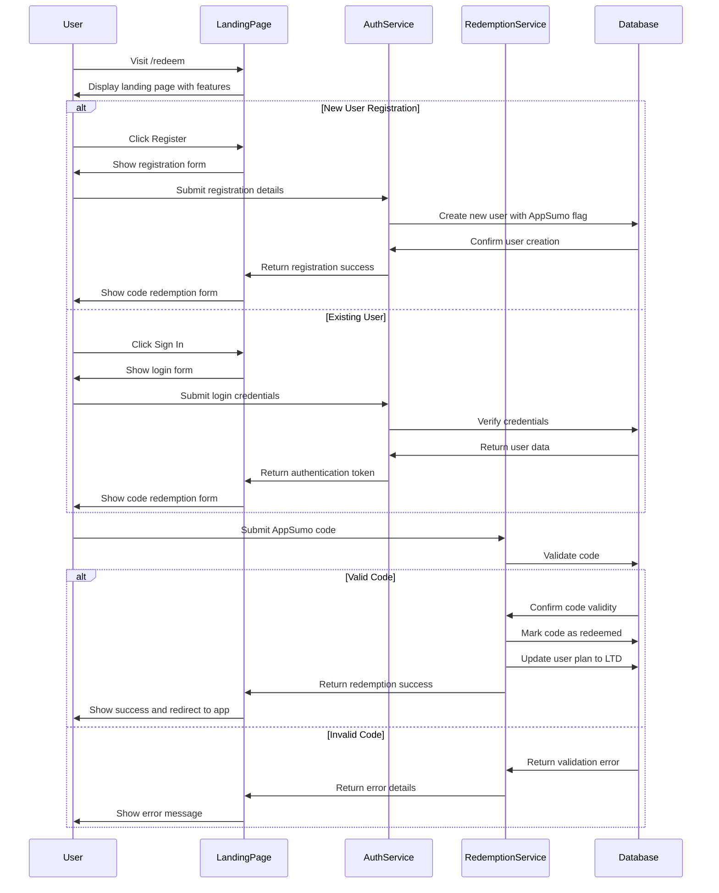

# Design Document: AppSumo LTD Landing Page

## Overview

This design document outlines the implementation approach for the AppSumo Lifetime Deal (LTD) landing page and redemption system. The feature will provide a dedicated landing page at `/redeem` that showcases SpendlyAI's features through interactive visualizations, communicates LTD benefits, and enables users to register and redeem their AppSumo codes to access their purchased plans.

## Architecture

The AppSumo LTD landing page will be integrated into the existing SpendlyAI React application with the following architectural components:

1. **Frontend Components**:
   - Landing page with feature showcases and interactive visualizations
   - Registration form for new AppSumo users
   - Code redemption interface
   - Authentication integration with existing system

2. **Backend Services**:
   - AppSumo code validation and redemption service
   - User registration with AppSumo-specific attributes
   - Plan activation based on code redemption

3. **Database Extensions**:
   - AppSumo codes table
   - User plan type extensions for LTD plans
   - Redemption tracking and analytics

## Components and Interfaces

### Landing Page Components

1. **Hero Section**
   - Headline and subheading highlighting AppSumo LTD offer
   - Call-to-action buttons for registration and redemption
   - Visual element showcasing the application

2. **Feature Showcase Sections**
   - Interactive visualization components for each core feature:
     - Expense Tracking Visualization
     - AI Advisor Interactive Demo
     - Budget Management Interactive Charts
     - Analytics Dashboard Preview
     - Document Processing Simulation

3. **LTD Benefits Section**
   - Plan comparison table (LTD vs Regular subscriptions)
   - Highlighted lifetime benefits
   - Value proposition elements

4. **Registration Component**
   - Email, password, and name input fields
   - Form validation
   - Submission handling with error states

5. **Code Redemption Component**
   - Code input field with validation
   - Redemption status indicators
   - Success/error messaging

### Interactive Feature Visualizations

Instead of static images, we'll implement interactive components for each feature:

1. **Expense Tracking Visualization**
   ```tsx
   // Interactive component showing expense categorization
   const ExpenseTrackingDemo = () => {
     const [activeCategory, setActiveCategory] = useState('food');
     // Interactive state and animations
     
     return (
       <div className="interactive-demo">
         <CategorySelector 
           activeCategory={activeCategory} 
           onChange={setActiveCategory} 
         />
         <ExpenseBreakdown category={activeCategory} />
         <TransactionTimeline category={activeCategory} />
       </div>
     );
   };
   ```

2. **AI Advisor Interactive Demo**
   ```tsx
   // Interactive AI conversation simulation
   const AIAdvisorDemo = () => {
     const [conversation, setConversation] = useState([
       { role: 'user', message: 'How can I reduce my monthly expenses?' },
       { role: 'ai', message: 'Based on your spending patterns, I notice you spend 30% more on dining than average...' }
     ]);
     
     // Demo interaction logic
     
     return (
       <div className="ai-conversation-demo">
         <ConversationThread messages={conversation} />
         <DemoQueryInput onSendMessage={handleDemoMessage} />
       </div>
     );
   };
   ```

3. **Budget Management Interactive Charts**
   ```tsx
   // Interactive budget allocation visualization
   const BudgetManagementDemo = () => {
     const [allocations, setAllocations] = useState({
       housing: 30,
       food: 15,
       transportation: 10,
       entertainment: 5,
       savings: 20,
       other: 20
     });
     
     // Interactive budget adjustment logic
     
     return (
       <div className="budget-demo">
         <BudgetPieChart allocations={allocations} />
         <BudgetSliders 
           allocations={allocations} 
           onChange={handleAllocationChange} 
         />
         <BudgetInsights allocations={allocations} />
       </div>
     );
   };
   ```

4. **Analytics Dashboard Preview**
   ```tsx
   // Interactive analytics visualization
   const AnalyticsDemo = () => {
     const [timeframe, setTimeframe] = useState('month');
     const [metric, setMetric] = useState('spending');
     
     // Demo data and interaction logic
     
     return (
       <div className="analytics-demo">
         <TimeframeSelector value={timeframe} onChange={setTimeframe} />
         <MetricSelector value={metric} onChange={setMetric} />
         <DynamicChart timeframe={timeframe} metric={metric} />
         <InsightCards timeframe={timeframe} metric={metric} />
       </div>
     );
   };
   ```

5. **Document Processing Simulation**
   ```tsx
   // Interactive document processing demo
   const DocumentProcessingDemo = () => {
     const [stage, setStage] = useState('upload');
     
     // Demo processing stages
     
     return (
       <div className="document-demo">
         <ProcessingStages currentStage={stage} />
         <DocumentPreview stage={stage} />
         <ProcessingResults stage={stage} />
         <DemoControls onStageChange={setStage} />
       </div>
     );
   };
   ```

### Authentication and Redemption Flow



## Data Models

### AppSumo Code Model

```typescript
interface AppSumoCode {
  id: string;
  code: string;
  plan_type: 'basic_ltd' | 'premium_ltd' | 'ultimate_ltd';
  is_redeemed: boolean;
  redeemed_by?: string; // User ID
  redeemed_at?: Date;
  created_at: Date;
  expires_at?: Date;
}
```

### User Model Extension

```typescript
interface UserProfile {
  // Existing user fields
  id: string;
  email: string;
  full_name: string;
  
  // AppSumo specific fields
  is_appsumo_user: boolean;
  appsumo_plan?: 'basic_ltd' | 'premium_ltd' | 'ultimate_ltd';
  appsumo_code_id?: string;
  appsumo_redeemed_at?: Date;
}
```

### Redemption Record

```typescript
interface RedemptionRecord {
  id: string;
  user_id: string;
  code: string;
  plan_type: 'basic_ltd' | 'premium_ltd' | 'ultimate_ltd';
  redeemed_at: Date;
  ip_address: string;
  user_agent: string;
}
```

## Error Handling

1. **Registration Errors**
   - Email already exists
   - Invalid email format
   - Password complexity requirements not met
   - Network or server errors

2. **Code Redemption Errors**
   - Invalid code format
   - Code already redeemed
   - Code expired
   - Code not found
   - Network or server errors

3. **Authentication Errors**
   - Invalid credentials
   - Account locked
   - Email not verified (if applicable)

4. **Error Display Strategy**
   - Inline form validation errors
   - Toast notifications for system errors
   - Dedicated error states for critical flows

## Testing Strategy

1. **Unit Tests**
   - Test individual components (registration form, redemption form, interactive visualizations)
   - Test validation logic for forms
   - Test state management for interactive components

2. **Integration Tests**
   - Test registration flow end-to-end
   - Test redemption flow with various code states
   - Test authentication integration

3. **Visual Regression Tests**
   - Ensure landing page renders correctly across devices
   - Verify interactive visualizations display properly

4. **Performance Tests**
   - Measure and optimize loading time for interactive components
   - Ensure smooth animations and transitions

5. **Accessibility Tests**
   - Verify WCAG compliance for all interactive elements
   - Test keyboard navigation and screen reader compatibility